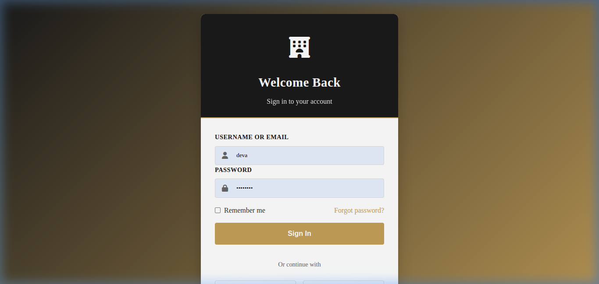
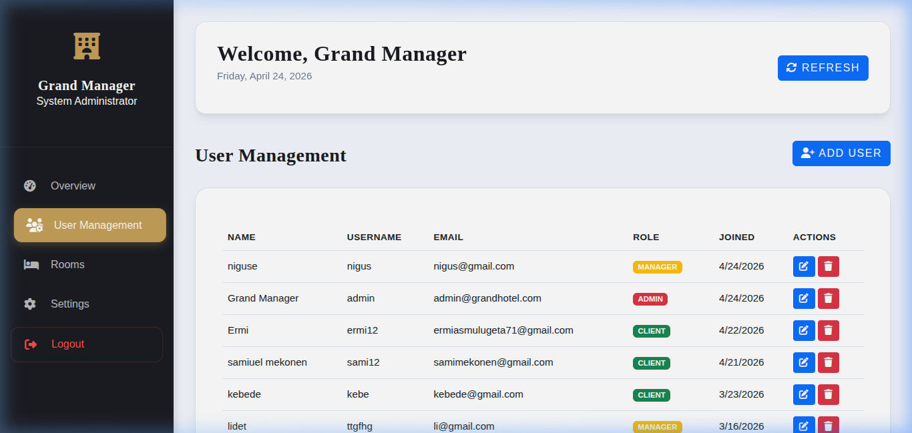
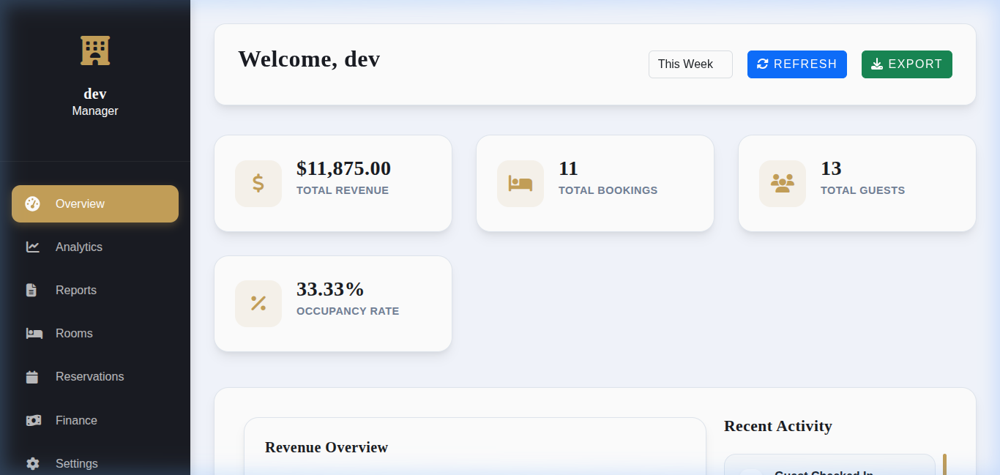

# Grand Hotel Management System

<p align="center">
  
</p>

<p align="center">
  <strong>A full-stack hotel reservation and operations system for guests, reception staff, managers, and administrators.</strong>
</p>

To see the project live click the link: https://hotel-reservation-system.infinityfreeapp.com/

## 📸 Screenshots

<p align="center">
  
  
  
  
</p>

## Preview

<table>
  <tr>
    <td width="50%">
      <h3 align="center">Home Page</h3>
      
    </td>
    <td width="50%">
      <h3 align="center">Login Page</h3>
      
    </td>
  </tr>
  <tr>
    <td width="50%">
      <h3 align="center">Admin Dashboard</h3>
      
    </td>
    <td width="50%">
      <h3 align="center">Manager Dashboard</h3>
      
    </td>
  </tr>
</table>

## Key Features

- **Multi-role authentication** for Admin, Manager, Reception, and Client accounts.
- **Role-based dashboards** with views and actions tailored to each user type.
- **Room reservation workflow** with availability, pricing, guest count, special requests, and booking status.
- **Room management** for room types, capacity, nightly rates, and availability status.
- **Service booking** for dining, spa, transportation, laundry, and room service add-ons.
- **Payment support** with payment records, transaction status, and Stripe configuration placeholders.
- **Operational analytics** for managers, including revenue, occupancy, and guest statistics.
- **Admin user management** for creating and managing system users and roles.
- **Authentication utilities** for login, registration, password reset, and social login configuration.

## Tech Stack

| Layer | Tools |
| --- | --- |
| Frontend | HTML5, CSS3, Bootstrap 5, FontAwesome, JavaScript |
| Backend | PHP 7.4+ |
| Database | MySQL |
| Security | Bcrypt password hashing, backend role checks, role-based redirects |
| Integrations | Stripe placeholders, Google Identity Services placeholders, Facebook login placeholders, SMTP placeholders |

## Project Structure

```text
Hotel-Reservation-System/
├── api/                         # Backend endpoints for auth, rooms, reservations, services, users, payments
├── config/                      # Database connection and third-party secret configuration
├── css/                         # Shared, auth, dashboard, notification, and booking success styles
├── database/                    # MySQL schema and seed data
├── docs/images/                 # README screenshots
├── images/                      # Homepage room, service, and hero images
├── includes/                    # Shared PHP helpers, auth functions, and validation
├── js/                          # Dashboard, auth, payment, notification, and API JavaScript
├── logs/                        # Application logs
├── admin-dashboard.html         # Admin dashboard UI
├── client-dashboard.html        # Client dashboard UI
├── manager-dashboard.html       # Manager dashboard UI
├── reception-dashboard.html     # Reception dashboard UI
├── index.html / index.php       # Main entry pages
├── login.php / register.html    # Authentication pages
├── run_seed.php                 # Seed runner
├── setup_db.php                 # Database setup helper
└── setup_mysql_user.sh          # Local MySQL user setup helper
```

## Database Overview

The MySQL schema is defined in `database/schema.sql` and includes:

| Table | Purpose |
| --- | --- |
| `users` | Stores accounts, roles, contact info, and social login IDs |
| `rooms` | Stores room number, type, capacity, price, amenities, and status |
| `reservations` | Stores guest bookings, dates, status, requests, and total price |
| `services` | Stores hotel add-on services and categories |
| `booking_services` | Links reserved services to reservations |
| `payments` | Stores payment method, amount, transaction ID, and payment status |

Seed data in `database/seed.sql` creates sample rooms, hotel services, and default users for every role.

## Installation & Setup

1. Clone the repository:

   ```bash
   git clone <repository-url>
   cd Hotel-Reservation-System
   ```

2. Create the MySQL database and tables:

   ```bash
   mysql -u root -p < database/schema.sql
   ```

3. Configure database credentials in `config/database.php`.

   The default database name used by the project is `hotel_management`.

4. Optional: configure integration placeholders in `config/secrets.php`.

   Add your own Stripe, Google, Facebook, SMTP, and base URL values before using those features in production.

5. Seed the sample data:

   ```bash
   php run_seed.php
   ```

6. Start the local PHP server:

   ```bash
   php -S localhost:8000
   ```

7. Open the app in your browser:

   ```text
   http://localhost:8000
   ```

## Default Credentials

All seeded accounts use `password` as the default password.

| Role | Username | Password |
| --- | --- | --- |
| Admin | `admin` | `password` |
| Manager | `manager` | `password` |
| Reception | `reseption` | `password` |
| Client | `client` | `password` |

## Main Pages

| Page | Description |
| --- | --- |
| `index.html` / `index.php` | Public hotel landing and booking entry |
| `login.php` | User login |
| `register.html` | Client registration |
| `client-dashboard.html` | Guest reservations, services, and profile tools |
| `reception-dashboard.html` | Front desk booking and guest operations |
| `manager-dashboard.html` | Analytics and operational oversight |
| `admin-dashboard.html` | User and system administration |

## API Modules

| Endpoint File | Responsibility |
| --- | --- |
| `api/auth.php` | Login, registration, logout, and session-related actions |
| `api/dashboard.php` | Dashboard metrics and role-specific data |
| `api/rooms.php` | Room listing and management |
| `api/reservation.php` | Booking and reservation operations |
| `api/services.php` | Hotel service listing and management |
| `api/booking_services.php` | Service requests attached to reservations |
| `api/payments.php` | Payment creation and status management |
| `api/payment-success.php` | Payment success handling |
| `api/password-reset.php` | Password recovery workflow |
| `api/users.php` | User and role management |

## Notes

- Use the default credentials only for local development and demos.
- Replace placeholder keys in `config/secrets.php` before enabling integrations.
- Keep production database passwords and API secrets private.
- If the local database user does not exist, review `setup_mysql_user.sh` or update `config/database.php` for your MySQL setup.
